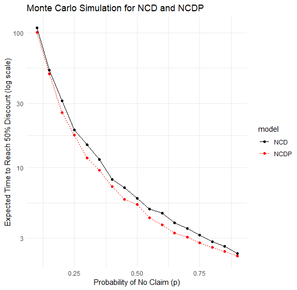
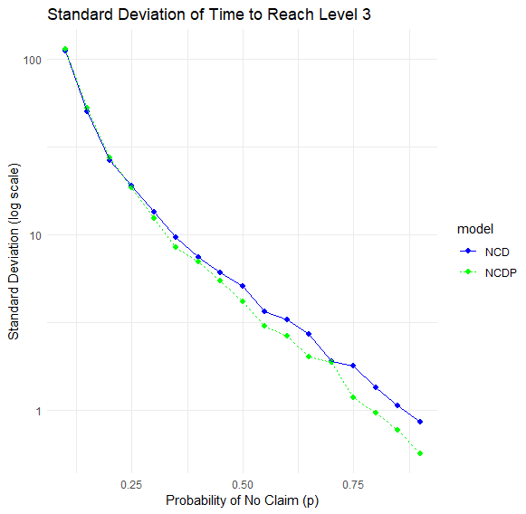

# Insurance Risk Monte Carlo

An R-based Monte Carlo simulation project modelling insurance risk processes, including no-claims discount progression and aggregate claim amount estimation.

This project demonstrates stochastic simulation, Markov-style insurance state modelling, claim frequency/severity modelling, and risk reserve estimation using simulated insurance claim distributions.

## Project Overview

The project explores two insurance risk problems:

1. **No-claims discount modelling**
   - Simulates the time taken for a policyholder to reach the highest no-claims discount level.
   - Compares a standard No Claims Discount model against a No Claims Discount Protection model.
   - Evaluates both expected time and standard deviation across different probabilities of making no claim.

2. **Aggregate claim amount simulation**
   - Simulates claim counts using a Poisson distribution.
   - Simulates individual claim amounts using an exponential distribution.
   - Estimates total monthly claim amounts.
   - Calculates expected claim totals, variance, and 95th percentile reserve estimates.

## Objectives

- Build Monte Carlo simulations for insurance risk processes in R
- Compare standard and protected no-claims discount schemes
- Analyse how the probability of no claim affects time to reach a 50% discount
- Estimate uncertainty using standard deviation of simulated outcomes
- Model aggregate insurance claims using frequency and severity distributions
- Estimate 95th percentile claim amounts for risk reserve planning

## Methods Used

- Monte Carlo simulation
- Markov-style state progression
- No Claims Discount modelling
- Poisson claim frequency modelling
- Exponential claim severity modelling
- Aggregate claim amount simulation
- Percentile-based reserve estimation
- Log-scale visualisation with ggplot2

## Key Findings

The simulations show that as the probability of no claim increases, the expected time to reach the highest discount level decreases sharply.

The No Claims Discount Protection model generally reduces the expected time to reach the highest discount level compared with the standard No Claims Discount model, especially when claim probabilities are moderate.

The aggregate claims simulation demonstrates how uncertainty in both claim frequency and claim severity can be combined to estimate total claim exposure and high-percentile reserve requirements.

## Example Outputs

### Expected Time to Reach 50% Discount



### Standard Deviation of Time to Reach Level 3



## Repository Structure

```text
insurance-risk-monte-carlo/
├── docs/
│   └── stochastic_processes_project_1.pdf
├── outputs/
│   ├── ncd_ncdp_expected_time.png
│   └── ncd_ncdp_standard_deviation.png
├── src/
│   └── insurance_risk_monte_carlo.R
├── .gitignore
├── LICENSE
└── README.md
```

## Tools and Libraries
- R
- ggplot2
  
## Project Context

This project was completed as part of a stochastic processes module and has been cleaned and organised for portfolio use.

## Disclaimer

This project is for educational and portfolio purposes only. It should not be used as actuarial advice, financial advice, or as a production risk model.
